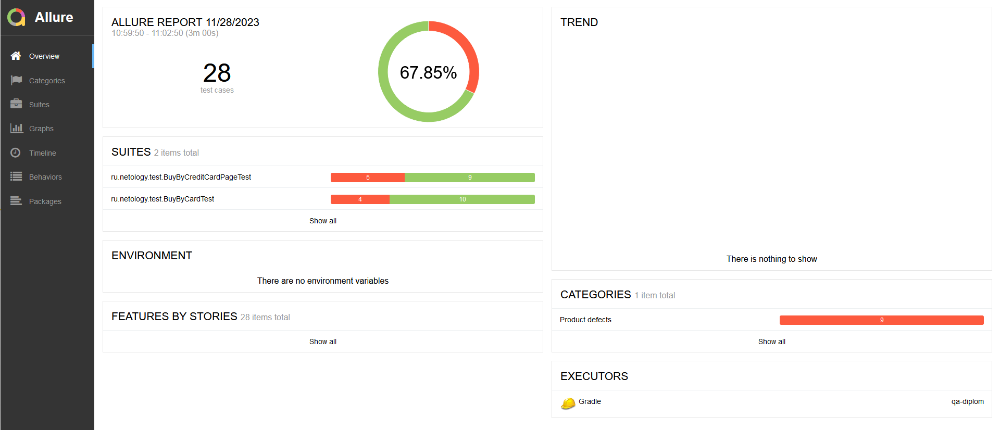

### Отчет о проведенном тестировании.

В ходе тестирования проверялось, как работает веб-приложение aqa-shop, а именно:

- какими данными допустимо / недопустимо заполнять поля формы
- как приложение взаимодействует с двумя СУБД, MySQL и PostgreSQL
Было написано 28 тестовых сценариев, из них при запуске падает 9 при подключении к СУБД и 19 успешно проходят.

