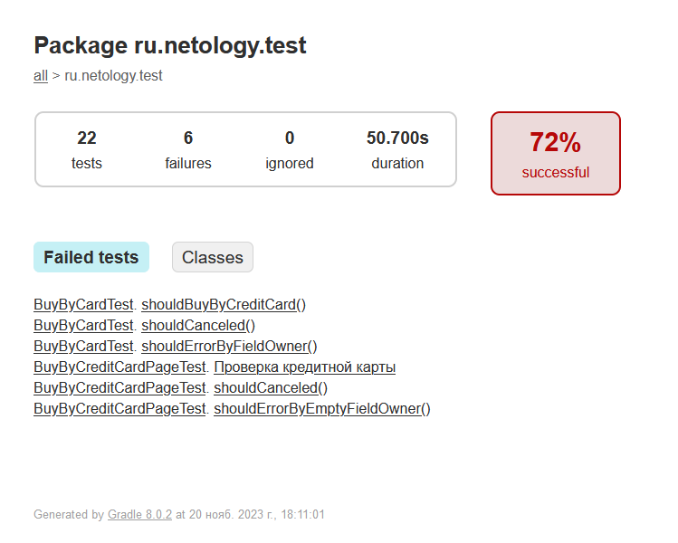

### Отчет о проведенном тестировании.

В ходе тестирования проверялось, как работает веб-приложение aqa-shop, а именно:

- какими данными допустимо / недопустимо заполнять поля формы
- как приложение взаимодействует с двумя СУБД, MySQL и PostgreSQL
Было написано 22 теста, из них при запуске падало 6 при подключении к MySQL и 16 успешно проходило.

